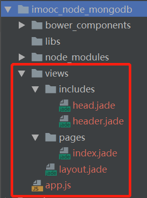

## 项目开发环境开启
### 开启mongoDB服务
- 管理员身份运行：`net start mongodb` 显示MongoDB服务已经启动成功
- 安装`bower`依赖：`$ bower install`（可能需要先npm install）
- 安装`npm`依赖：`$ npm install`
- 启动项目入口文件，运行app.js: `node app.js`

## 步骤：
（前提是安装好了node）
- 安装了mongodb，测试开启服务成功，安装了mongodb可视化工具robomongo，便于查看和开发

- 创建了红框框内的目录结构


- cnpm install -g express jade bower mongoose --save
- bower init(创建bower.json)
- bower install bootstrap -g(由于依赖关系，会同步安装jquery)，此时自动生成了bower_components文件夹，b、j的内容都被放到这个里面

- 为了方便项目的可移植性，我们不使用bower_components目录，
	- 创建public/libs目录
	- 创建bower配置文件.bowerrc，指定依赖库安装目录，内容为:
			{
			  "derectory": "public/libs"
			}
	- 修改项目入口文件app.js的相关配置：
	```
			app.use(express.static(path.join(__dirname, 'bower_components')))--->
			app.use(express.static(path.join(__dirname, 'public')))
	```
	- 删除bower_components目录
	- 重新在命令行安装bootstrap：bower install bootstrap

	- 相应的，在head.jade中引用的时候，也要用相对应的路径：
	```
			link(href="/libs/bootstrap/dist/css/bootstrap.min.css" rel="stylesheet")
			script(src="/libs/jquery/dist/jquery.min.js")
			script(src="/libs/bootstrap/dist/js/bootstrap.min.js")
			```


## 表单提交解析
- npm install body-parser --save
- var bodyParser = require('body-parser');
- // 因为后台录入页有提交表单的步骤，故加载此模块方法（bodyParser模块来做文件解析），将表单里的数据进行格式化
- app.use(bodyParser.urlencoded({extended: true}));

## 在ubuntu上保持运行

### pm2使用
- `npm install -g pm2`
- 启动`pm2 start app.js`


